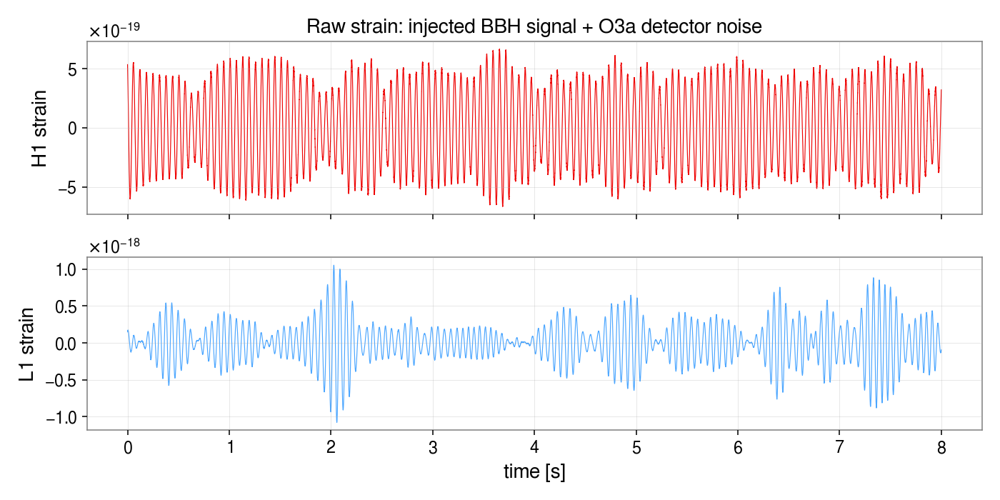
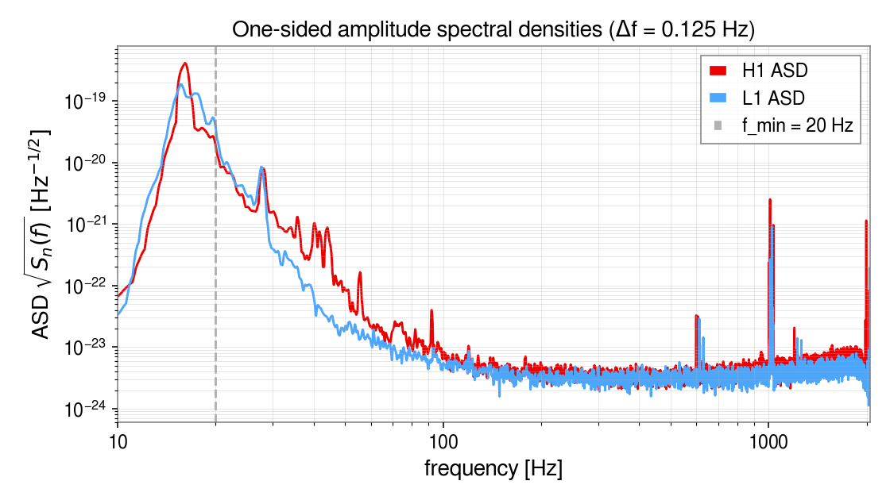
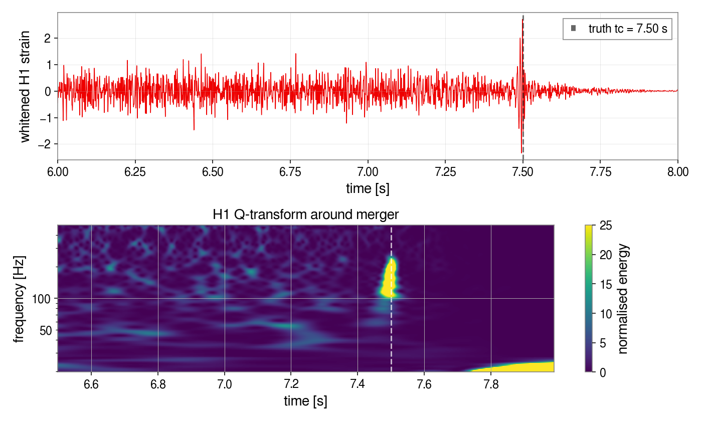
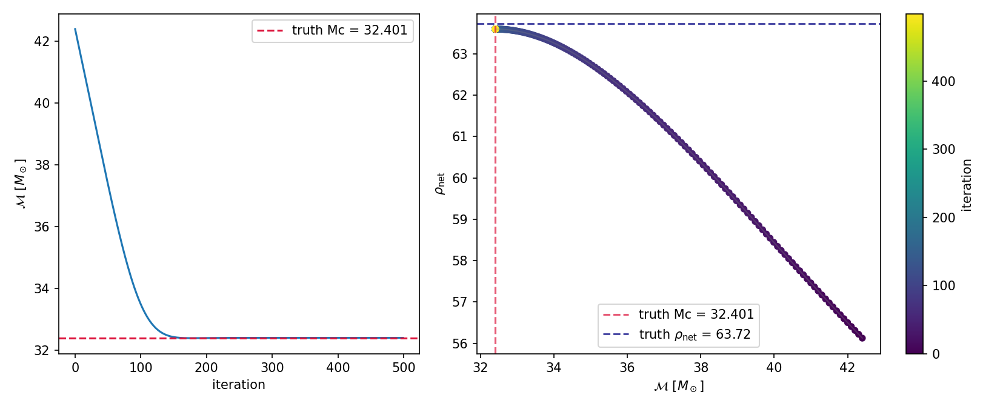

# Wavetune

Differential fitting of an
[`ml4gw`](https://github.com/ML4GW/ml4gw) `IMRPhenomD` gravitational-wave
waveform to single-detector (L1) strain data. The chirp mass is recovered
by gradient-descending the time-maximised matched-filter SNR with PyTorch
autograd; the trajectory in (Mc, ρ) is recorded along the way.

Upstream dataset generator
[`GWDatasetGeneration`](https://github.com/chreissel/GWDatasetGeneration)
is vendored as a git submodule under `GWDatasetGeneration/` and is used
to produce the fit input.

## Install

```
git submodule update --init
pip install -r requirements.txt
```

Both the fit and the data-generation wrapper (`generate_fit_input.py`)
run on `ml4gw` + PyTorch. Install a matching CUDA `torch` wheel first if
you want GPU acceleration. `gwpy` is used for the time/frequency
visualisations in the notebook and `scripts/make_data_plots.py`.

## Input data

Both the notebook and `fit_waveforms.py` read a single HDF5 event that
contains L1's time-domain strain (signal + background), its PSD on the
matching rFFT grid, and the antenna-pattern factors for the source sky
location and time:

```
/L1/strain                       float   [N]         time-domain strain at L1
/L1/psd                          float   [N//2 + 1]  one-sided PSD on rfftfreq(N, 1/fs)
/antenna/L1/{fplus,fcross}       scalar              F+, Fx for L1
/truth/*                         scalar              chirp_mass, mass_ratio, chi1/2, distance,
                                                     tc, phic, inclination, snr, snr_L1
attrs: sample_rate, f_min, f_max, f_ref, duration
```

Two pre-generated BBH events live in `example_data/`
(`data_BBH_highSNR.h5`, `data_BBH_lowSNR.h5`). Make your own with
`generate_fit_input.py`.

By default it sweeps the target network SNR from 10 to 100 in steps of
10, writing one event per SNR into `example_data/`:

```
python generate_fit_input.py \
    --config GWDatasetGeneration/configs/config_BBH.yaml \
    --data   /path/to/background_data
# -> example_data/data_BBH_snr10.h5 ... example_data/data_BBH_snr100.h5
```

The filename label (`BBH`) is taken from the config name and the SNR
from each sweep step (`data_<label>_snr<snr>.h5`). Tune the sweep with
`--snr-min/--snr-max/--snr-step`, the destination with `--out-dir`, and
override the label with `--label`. For a single event, pass `--out`
(optionally with `--target-snr` to fix its network SNR):

```
python generate_fit_input.py \
    --config GWDatasetGeneration/configs/config_BBH.yaml \
    --data   /path/to/background_data \
    --out    data.h5 --target-snr 30
```

The generator mirrors upstream `injections.py`:

- **SNR reweighting rescales each waveform's amplitude** to hit its
  target network SNR — a fixed value per sweep step (or `--target-snr`),
  otherwise a draw from `config.snr_reweighting` (e.g. `PowerLaw[12,100,-3]`
  in the BBH config). In single-event mode, `--no-reweight` uses the raw
  distance-implied SNR instead.
- **Whitening is intentionally skipped.** The matched-filter inner
  product `4 Δf Re Σ d*·h / S_n` already "whitens" both sides via the
  `1/S_n` factor, so the fit needs raw coloured strain + PSD rather
  than a pre-whitened time series.

## What the data looks like

So far, we only tested on signals from binary-black-hole merging. The data contains an 8-second long L1 strain (sampled at 4096 Hz) with real O3a noise:



The PSD is the L1 noise floor over the same segment. The
band `[f_min, f_max]` used in the inner product (default `[20, fs/2]`)
keeps the `f = 0` bin out of the sum:



Whitening the L1 strain by `1/√S_n` and band-passing 30–400 Hz makes
the chirp visible by eye; the Q-transform shows the characteristic
frequency sweep ramping up to merger at `truth/tc`:



## `fit_waveforms.py` — the network fit, scripted

The standalone script reproduces the notebook's L1 chirp-mass fit
without the preceding pedagogy. Internally it:

- loads the HDF5 event (`load_event`),
- builds the L1 `(d̃, 1/S_n, F+, F×)` with a Tukey-windowed FFT
  (`build_detectors`, `tukey_window`),
- collects the fixed non-mass `IMRPhenomD` parameters from `/truth`
  (`fixed_params_from_truth`),
- constructs a PyTorch loss `-ρ²_L1` time-maximised via one inverse FFT
  (`make_loss`), differentiated by autograd through the `ml4gw` waveform,
- runs Adam with a cosine-annealed learning rate (`fit_network_mc`),
- and writes a two-panel trajectory plot (`plot_history`).

The loss still loops over a `detectors` dict, so passing
`--detectors H1 L1` restores the original incoherent network sum.

Usage:

```
python fit_waveforms.py \
    --data example_data/data_BBH_highSNR.h5 \
    --out  plots/fit_history.png \
    --mc-offset 10.0 --steps 500 --lr 0.1 --lr-final 1e-3
```

Defaults reproduce the notebook's L1 fit: start `mc_truth + 10`
Msun off, 500 Adam steps with `lr 0.1 → 1e-3` cosine annealing. Only the
chirp mass is updated; all other `IMRPhenomD` parameters are held at
their truth values. To fit additional parameters, make them
`requires_grad` tensors and extend `make_loss` in `fit_waveforms.py`.

Running on `example_data/data_BBH_highSNR.h5` recovers truth
(Mc ≈ 32.40 Msun) from a +10 Msun offset and reaches the truth L1
SNR within the last few iterations:



Stdout reports the initial / final / truth (Mc, ρ_L1) triple.

## Notes

- Uses `ml4gw.waveforms.IMRPhenomD`, the same model `GWDatasetGeneration`
  uses to make the injections. Two small shims (see the top of
  `fit_waveforms.py` / the notebook's first cell) make it differentiable:
  a detached `torch.heaviside` and an out-of-place `phenom_d_mrd_amp`.
  For BNS with tidal effects swap in an `IMRPhenomD_NRTidalv2`-style model
  and add `lambda1, lambda2`.
- Matched-filter inner product is `4 Δf Re Σ d*·h / S_n`, assuming a
  one-sided PSD on a uniform frequency grid.
- The fit runs on a **single detector (L1)**, so the statistic is just
  `max_t |z_L1(t)|²`. The loss code still sums over a `detectors` dict, so
  passing more detectors restores an **incoherent** network sum — each
  detector's peak chosen independently, not constrained to a common
  geocentric arrival time (coincident- rather than coherent-search
  convention).
- Antenna factors are loaded as constants from the HDF5; extending the
  fit to sky location would make them functions of `(ra, dec, ψ, t_gps)`.
